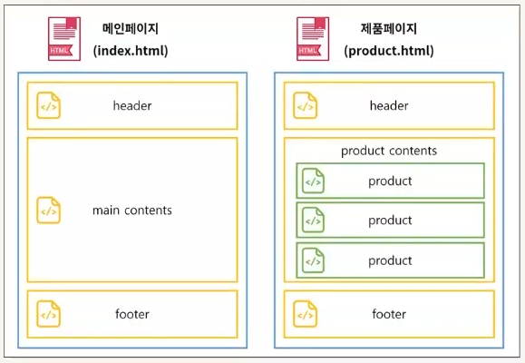

# *[ROOT/README.md](../README.md)*
# *[Svelte4 프로젝트 세팅](INSTALL.md)*

# *Ch01) 컴포넌트*
<details>
<summary>접기/펼치기</summary>
<br>


HTML과 Javascript만으로 하드코딩할때의 DOM은 헤더 푸터와 같이 동일한 영역임에도 계속 랜더링되는 문제가 있다.  
페이지가 이동할때마다 해당 구역을 다시 렌더링하기 때문에 시간도 오래걸리고 용량도 많이 차지한다.  
React와 Vue가 가상돔을 만들어 사용한 이유가 바로 그것이다.  
가상적으로 불러와서 렌더링 시간과 용량을 줄이는 이점을 가진다.  
하지만 Svelte는 가상돔 없이 제작하는 프레임워크이다.  
그러나 컴포넌트를 사용한다.  
예를들어 일반적인 HTML에서 헤더영역의 경우 모든 페이지마다 헤더 영역을 하드코딩 해야하므로  
헤더에 있는 글자 하나만 변경하려 해도 모든 페이지의 글자를 변경해야한다.  
이러한 비효율적인 작업을 위해 컴포넌트를 사용한다.  

피그마라는 그래픽 프로그램에서도 컴포넌트를 사용한다.
반복되는 디자인 요소를 컴포넌트화 한 후 원하는 영역들에 해당 컴포넌트를 배치한다.  
이후 컴포넌트를 수정하면 모든 인스턴스가 일괄적으로 수정된다.  
React, Vue, Svelte에서도 위와같은 특성이 컴포넌트를 사용하는 주된 목적이다

### 1) 컴포넌트를 사용하는 이유
1. 분류를 통한 관리의 효율성
2. 재사용을 통한 개발의 효율성

### 2) Svelte 컴포넌트 구조
- 스크립트 영역
- 마크업 영역
- 스타일 영역
세개의 영역으로 나뉘며 각 영역들의 순서는 관계없고, 3개 영역 모두 없어도 오류는 발생하지 않는다.
```svelte
/* 스크립트 영역 */
<script></script>

/* 마크업 영역 */

/* 스타일 영역 */
<style></style>
```  

### 3) 하위 컴포넌트 불러오기
컴포넌트는 재사용을 위해 사용되며 다른 컴포넌트를 내 컴포넌트로 불러 재사용한다.  
참조하는 컴포넌트는 상위 컴포넌트이고, 참조 되는 컴포넌트는 하위 컴포넌트이다.  
상위 컴포넌트는 부모 컴포넌트라고 부르며 하위 컴포넌트는 자식 컴포넌트라고 부른다.  
상위 컴포넌트 내 하위 컴포넌트 끼리는 형제 컴포넌트라고 부른다.  
```svelte
/* 스크립트 영역 */
<script>
  import 컴포넌트명 from './컴포넌트 파일 경로/컴포넌트.svelte'
</script>

/* 마크업 영역 */
<컴포넌트명/>
<컴포넌트명><div>자손</div></컴포넌트명>
```  
위와 같이 스크립트 영역에서 ESM(ES6 Module 시스템)의 import 구문을 사용하여 불러온 뒤 마크업 영역에 태그로 선언한다.  
- 순수 컴포넌트만 사용
  ```svelte
  <컴포넌트명/>
  ```
- 자식 DOM을 포함하는 경우
  ```svelte
  <컴포넌트명>자손</컴포넌트명>
  ```

## 스벨트 기본구조
- public/index.html
- src/main.js
- src/App.svelte
### `src/main.js`
Svelte 프레임워크의 진입점(Entry Point)이다.  
전역으로 css와 라이브러리 등록 및 초기화, 개발/운영 분기 등의 작업을 설정하며, 최초 스벨트 컴포넌트를 불러와 인스턴스화 한 후 렌더링 되도록 설정한다.  

실제 코드를 보면 App.svelte 컴포넌트를 인스턴스화 한 후 index.html의 body영역에 렌더링한다.
```js
import App from './App.svelte';

const app = new App({
	target: document.body,
	props: {
		name: 'world'
	}
});

export default app;
```
App 컴포넌트를 인스턴스화 할때 컴포넌트 프로퍼티 객체를 파라미터로 전달한다.  
#### 컴포넌트 프로퍼티 구성
- target : 마운트 위치미여 이곳에 App 컴포넌트가 실제 렌더링 될 dom 위치를 작성한다.  
- props : App.svelte 컴포넌트에 prop을 전달한다.  

### `src/App.svelte`
최상위 컴포넌트이며, 해당 컴포넌트에서 main.js로 모든 데이터를 전달한다.  
실제 자바스크립트는 svelte파일을 읽을 수 없기 때문이다.  

## 예제) 컴포넌트 구성 및 배치



### 컴포넌트 구성 
#### src/App.svelte
- src/MainPage.svelte
- src/ProductPage.svelte
```svelte
<script>
	import MainPage from "./MainPage.svelte";
	import ProductPage from "./ProductPage.svelte";
</script>

<MainPage/>
<hr>
<ProductPage/>
```

##### MainPage.svelte
- Header.svelte
- Main.svelte
- Footer.svelte
```svelte
<script>
  import Header from "./Header.svelte";
  import Footer from "./Footer.svelte";
  import Main from "./Main.svelte";
</script>
<Header/>
<Main/>
<Footer/>
```

##### ProductPage.svelte
- Header.svelte
- Product.svelte
- Footer.svelte

###### Main.svelte
```svelte
<h1>메인 영역</h1>
```
###### Product.svelte
```svelte
<h5>제품 영역</h5>
```

##### 공통 레이아웃
###### Header.svelte
```svelte
<h1>헤더 영역</h1>
```
###### Footer.svelte
```svelte
<h1>푸터 영역</h1>
```

</details>
<br>

# template
<details>
<summary>접기/펼치기</summary>
<br>

</details>
<br>
