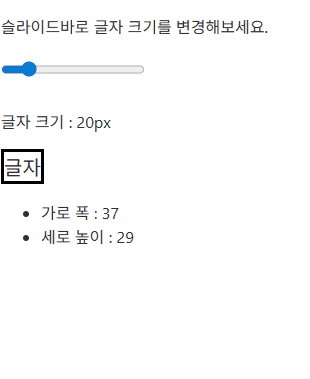

# *[ROOT/README.md](../README.md)*
# *[Svelte4 프로젝트 세팅](INSTALL.md)*
<br>

# *[Ch01) Component](../Ch01_Component/README.md)*
# *[Ch02) State 01 - 기본 및 @html](../Ch02_State01/README.md)*
# *[Ch02) State 02 - 이벤트 활용 및 객체, 객체-배열 타입](../Ch02_State02/README.md)*
# *[Ch03) Reactivity](../Ch03_Reactivity/README.md)*
# *[Ch04) Event](../Ch04_Event/README.md)*
# *[Ch05) Props](../Ch05_Props/README.md)*
# *[Ch06) IfBlock](../Ch06_IfBlock/README.md)*
# *[Ch07) EachBlock](../Ch07_EachBlock/README.md)*
# *[Ch08) Bind01 - input (value, checked, group)](../Ch08_Bind01/README.md)*
# *[Ch09) Bind02 - select (multiple), textarea, media](../Ch09_Bind02/README.md)*
# *Ch10) Bind03 - this, component, dimension*
<details>
<summary>접기/펼치기</summary>
<br>

## this(dom), component(props), dimension(공간)

### this 바인딩
svelte에서 지원하는 dom 접근 방식으로 `bind:this`형태로 this 키워드를 bind 디렉티브에 할당한다.  
`<태그명 bind:this={상태변수} />` 형태로 접근하려는 태그에 작성하여 해당 태그의 dom 객체에 접근한다.  
할당한 변수에는 dom 객체가 할당된다.  

```svelte
<script>
  let bindThis = '';
</script>
<input bind:this={bindThis} />
```

<br>

#### 예제01) input 패스워드 유효성 검사 (input focus)
입력란에 패스워드 입력 후 버튼을 클릭했을 때 패스워드가 1234이면 입력란이 초록색으로, 1234가 아니면 빨간색으로 표시하며 포커싱이 적용된다.
```svelte
<script>
  let text = ''; // input value
  let clicked = false; // 클릭여부
  let validated = false; // 비밀번호 일치 여부
  let inputRef;

  const onValidatedCheck = () => {
    clicked = true;
    validated = text === '1234'
    if(!validated) {
      inputRef.focus();
    }
  }
</script>
<div>
  <form>
    <input 
      type="text" 
      bind:this={inputRef}
      bind:value={text} 
      class={clicked && (validated ? 'success' : 'failure')}
    >
    <button type="submit" on:click|preventDefault={onValidatedCheck}>검증하기</button>
  </form>
</div>
<style>
  .success{ background-color: lightgreen; }
  .failure{ background-color: lightcoral; }
</style>
```
### component 바인딩
Dom 속성을 바인딩하는 것처럼 컴포넌트의 props를 바인딩할 수 있다.  
props는 부모 컴포넌트에서 자식 컴포넌트로 전달하는 값이다.  
단방향 데이터로 자식 컴포넌트의 상태 값을 부모 컴포넌트에게 전달하지는 못한다.  
이때, bind 디렉티브를 사용하여 부모컴포넌트의 상태 변수와 자식 컴포넌트의 상태 변수가 연결되어 자식에서 부모의 상태값을 변경할 수 있다.  
VueJS 2의 `:prop.sync` 혹은 3의 `defineEmits(['update:prop']) / emit('update:count', 값)` 과 유사한 기능이다.

문법은 props 전달 문법앞에 `bind:`를 붙혀준다.
- props 전달
`<자식컴포넌트 props명={상태변수} />`
- component 바인딩
`<자식컴포넌트 bind:props명={상태변수} />`

#### 예제) 
- 부모 컴포넌트
  ```svelte
  <script>
    import Child from './child.svelte'
    let props = ''
  </script>
  <Child bind:props={props}/>
  ```
- 자식 컴트넌트
  ```svelte
  <script>
      export let props;
      const double = () => props *= 2;
  </script>

  <p>자손 값 : {props}</p>
  <button on:click={double}>두배구하기</button>
  ```

### Dimension(공간) 바인딩

cientWidth, cientHeight, offsetWidth, offsetHeight 속성들이 Dimension 바인딩에서 읽기 전용으로 바인딩 가능한 속성들로 읽기 전용이기 때문에 값을 변경해도 width와 height가 변경되지 않는다.  
(client는 테투리를 포함하지 않고 offset은 테두리를 포함한다.)  

위 속성들은 DOM 요소의 실제 크기를 측정하기 위한 브라우저 API이다.  
일반적으로 vue에서는 해당 dom에 ref를 심어 dom 객체로부터 clientWidth 등의 속성에 접근해야 하지만 svelte에서는 bind 문법을 통해 바로 상태를 할당하여 값을 읽을 수 있다.  

block과 inline-block이 아닌 inline 요소에는 영역이 존재하지 않기 때문에 바인딩이 불가능하므로 block 레벨 요소로 감싼 후 block 레벨 요소에 바인딩해야 한다.  

`<태그 bind:clientWitdth={상태변수}>`

#### 예제) 
A라는 div 태그 하위에 p나 span태그로 텍스트를 넣어두고, 해당 태그를 block 요소에서 input-block으로 바꿔 하위 요소만큼 영역이 잡히도록 한다.  
input 태그의 range를 통해 상태값을 변경하도록 조정하는데, 해당 상태값을 텍스트노드를 감싸고 있는 태그의 style 속성에 에 할당하여 텍스트의 크기를 키운다.  
텍스트의 크기가 커지면 텍스트 노드를 감싸고 있는 태그도 커지며, 해당 태그를 감싸고 있는 A div 태그의 크기도 커지는데 이때 dimension bind를 활용하면 해당 div의 너비와 높이를 읽어들일 수 있다.  



```svelte
<script>
  let w; // div 태그의 폭
  let h; // div 태그의 높이
  let size = 20; // 글자 크기
</script>

<p>슬라이드바로 글자 크기를 변경해보세요.</p>
<input type="range" min="10" max="100" bind:value={size} />
<p>글자 크기 : {size}px</p>
<div bind:clientWidth={w} bind:clientHeight={h}>
    <span style="font-size: {size}px;">글자</span>
</div>
<ul>
    <li>가로 폭 : {w}</li>
    <li>세로 높이 : {h}</li>
</ul>

<style>
    div{ display: inline-block; border: 3px solid black; }
</style>
```

</details>
